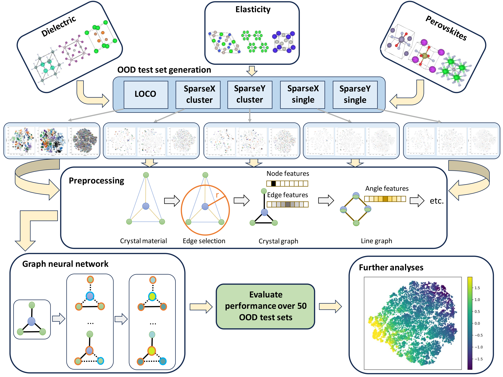

# OOD_Materials_Benchmark
Github repository for our manuscript - **"Structure-based out-of-distribution (OOD) material property prediction: a benchmark study"** \[[arxiv](https://arxiv.org/pdf/2401.08032.pdf)\]

Authors: Sadman Sadeed Omee, Nihang Fu, Ming Hu, and Jianjun Hu.


[Machine Learning and Evolution Laboratory,](http://mleg.cse.sc.edu)<br />
Department of Computer Science and Engineering, <br />
University of South Carolina,<br/>
SC, 29201, United States.

Traditional performance evaluation of material property prediction models through random splitting of the dataset frequently results in **artificially high performance assessments** due to inherent redundancy of typical material datasets. In real-world scenarios, machine learning (ML) models are usually employed to predict properties of novel exceptional materials that deviate from the training set distribution. It is thus a pressing question to provide an objective evaluation of ML models for **property prediction of out-of-distribution (OOD) samples**. Here we present a comprehensive **benchmark** study of structure-based graph neural networks (GNNs) for OOD materials property prediction. We formulate five different categories (LOCO, SparseXcluster, SparseYcluster, SparseXsingle, and SparseYsingle) of **OOD problems** for three benchmark datasets from the [MatBench](https://matbench.materialsproject.org/) study, and perform extensive experiments.



# Table of Contents
* [Algorithms](#algorithms)
* [Dataset](#dataset)
* [Target generation](#targets)
* [Contributors](#contributors)

<a name="algorithms"></a>
## Algorithms
We chose the following **graph neural network (GNN)** algorithms for our benchmark study. Source codes of the algorithms are also provided. To get more detailed implementations of the algorithms (including processing of the test cluster for each fold) for this benchmark study, the readers are requested to email the corresponding author at jianjunh@cse.sc.edu
1. [CGCNN](https://github.com/txie-93/cgcnn)
2. [MEGNet](https://github.com/materialsvirtuallab/megnet)
3. [SchNet](https://github.com/atomistic-machine-learning/SchNet)
4. [DimeNet++](https://github.com/gasteigerjo/dimenet)
5. [ALIGNN](https://github.com/usnistgov/alignn)
6. [DeeperGATGNN](https://github.com/usccolumbia/deeperGATGNN)
7. [coGN](https://github.com/materialsproject/matbench/tree/main/benchmarks/matbench_v0.1_coGN)
8. [coNGN](https://github.com/materialsproject/matbench/tree/main/benchmarks/matbench_v0.1_coNGN)

<a name="dataset"></a>
## Dataset
Datasets used in our work can be found in the **data.zip** file. The **targets.csv** files contain the ground truth properties. We used three datasets from the MatBench study. For simplicity, we refer to the matbench_dielectric dataset as the
**‘dielectric dataset’**, the matbench_log_gvrh dataset as the **‘elasticity dataset’**, and the matbench_perovskites dataset as the **‘perovskites dataset’**.

<a name="targets"></a>
## Target generation
In this work, we specifically concentrate on instances where the target set comprises no labeled samples.
Accordingly, we propose the following target set generation methods to simulate real-world conditions for materials
property prediction by creating 50 different folds for each method, where the test set for each fold differs in distribution from the train set. 

Train-val-test data for each fold for each dataset can be found in **folds.zip** file. The directory of the folds for each category of targets are given below (different possible option are written curly braces):

```bash
folds/{dielectric,elasticity,perovskites}_folds/{train,val,test}/OFM_dielectric_{LOCO,SparseXcluster,SparseYcluster,SparseXsingle,SparseYsingle}_target_clusters50_{train,val,test}.json
```

These json files contain the ids of the materials to be used in each of the 50 folds, for each of the target generation method, and for each of the dataset. To take a look at how the five different target generation methods were created, unzip the **target_generation.zip** file.

<a name="contributors"></a>
## Contributors

1. Sadman Sadeed Omee (<https://www.sadmanomee.com/>)
2. Dr. Jianjun Hu (<http://www.cse.sc.edu/~jianjunh/>)
